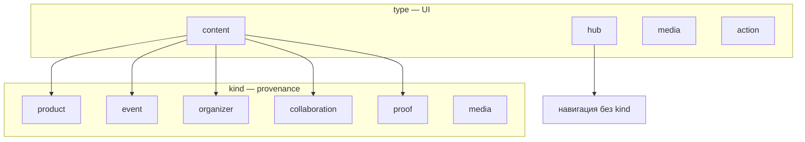
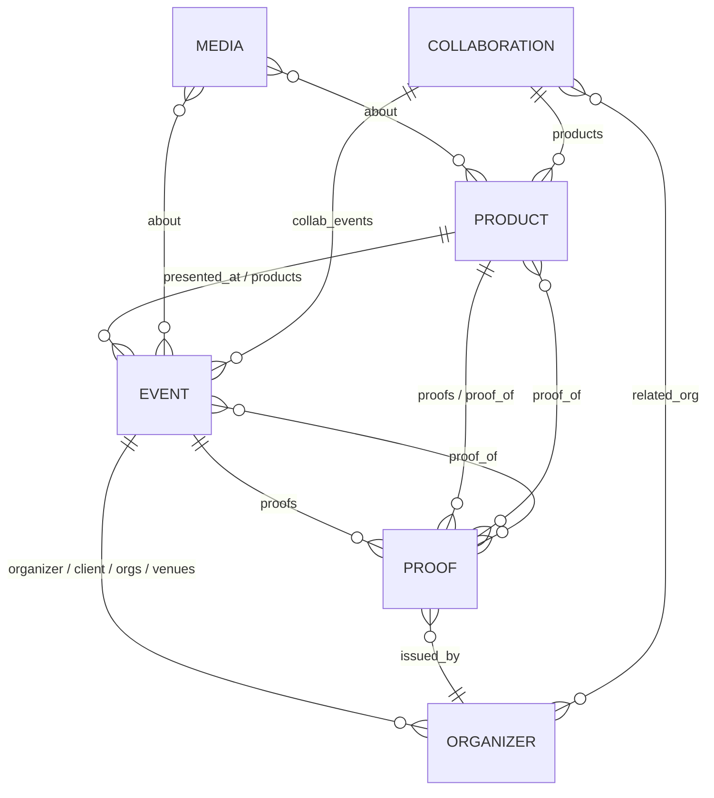

# CONTENT-SCHEMA — стандарт карточек ODA.dream

**Версия:** 1.2 · **Дата:** 2026.06.02  
**Статус:** единый источник правды по архитектуре базы знаний и контента сайта.

Документ описывает все типы карточек в `src/content/`, их поля, типы свойств Obsidian, связи между карточками и вспомогательные реестры в `data/registry/`.

---

## 1. Назначение

| Слой | Путь | Роль |
|------|------|------|
| **Карточки сайта** | `src/content/*.md` | Навигация Lotus, страницы, provenance на odadream.art |
| **Реестры** | `data/registry/*.yaml` | Ledgers для синхронизации (`proofs.yaml`, `organizations.yaml`, `works.yaml`; `engagements.yaml` — **снимок**, не редактировать вручную) |
| **Медиа-каталог** | `src/data/media.ts` | Канонические URL/постеры для `![[media:id]]` |
| **Таксономия UI** | `src/data/taxonomy.ts` | Подписи и бейджи для `subkind` |

**Правило:** факты о событии, продукте или организации живут **один раз** — в `.md` карточке. YAML-реестры **ссылаются** на id, а не дублируют тексты.

---

## 2. Два измерения типа

У каждой карточки два независимых классификатора:

### 2.1 `type` — поведение в интерфейсе Lotus

| `type` | Поведение | Иконка |
|--------|-----------|--------|
| `hub` | Контейнер: дети в сетке 3×3 | Layers |
| `content` | Текстовая страница | FileText |
| `media` | Сразу открывает lightbox | Film / Image / AudioLines |
| `action` | Внешняя ссылка / действие | Zap |

### 2.2 `kind` — семантическая роль в графе provenance

| `kind` | Назначение | Префикс id / файла |
|--------|------------|-------------------|
| `product` | Произведение, продукт, лекция как работа | `mindshow`, `neuromandala`, … |
| `event` | Событие, участие, выставка, лекция на площадке | `event-*`, `pleinair-*`, `eng-*` |
| `organizer` | Организация, площадка, куратор как сущность | `org-*` |
| `collaboration` | Равное со-творчество | `collab-*` |
| `proof` | Награда, письмо, отзыв, пресса | `proof-*` |
| `media` | Медиа-работа (фото/видео/эскиз как узел) | `media-*`, `work-*` |

**Навигационные hub-страницы** (`hub-works`, `hub-events`, …) обычно имеют `type: hub` и **не задают** `kind` — они только группируют детей.



---

## 3. Общие поля (все карточки)

Применяются к любой `.md` в `src/content/`, если не указано иное.

| Поле | Obsidian | Обяз. | Описание |
|------|----------|-------|----------|
| `id` | Text | **да** | Уникальный id (kebab-case). Совпадает с именем файла без `.md`. |
| `parent` | Link | **да** | Родитель в Lotus-графе. У корня `home` — нет (задаётся в `constants.ts`). |
| `title_en` | Text | **да** | Заголовок EN |
| `title_ru` | Text | **да** | Заголовок RU |
| `type` | Text | **да** | `hub` \| `content` \| `media` \| `action` |
| `date` | Text | рек. | Дата последнего изменения контента. Формат **`YYYY.MM.DD`** (точки). |
| `tags` | Tags | нет | Произвольные теги. Служебный: `hub-registry` — строка реестра участий. |
| `order` | Number | нет | Порядок в сетке Lotus (0–8) |
| `visible` | Checkbox | нет | `false` скрывает из сетки (по умолчанию виден) |
| `image` | Text | нет | URL обложки; иначе генерируется `public/images/nodes/{id}.svg` |
| `short_en` / `short_ru` | Text | нет | Короткий заголовок для плотного UI |
| `external_link` | Text | нет | URL для `type: action` или внешний источник у proof |

### Тело заметки

- **EN** — основной блок markdown после frontmatter.
- Разделитель **`---RU---`** на отдельной строке.
- **RU** — русский блок после разделителя.
- Wiki-ссылки: `[[node-id]]`, `[[node-id|подпись]]`.
- Встраивание узла в сетку: `[[node-id]]` в теле → petal с `_isEmbedded`.
- Медиа: `![[media:asset-id]]` или `![[url | title | poster]]` (см. `src/data/media.ts`).

---

## 4. Карточки по `kind`

### 4.1 `product` — продукт / работа

**Шаблон:** `src/content/_templates/product.md` · **Base:** `products.base`

| Поле | Obsidian | Обяз. | Связь | Описание |
|------|----------|-------|-------|----------|
| `kind` | Text | **да** | — | `product` |
| `subkind` | Text | **да** | taxonomy | `art` \| `education` \| `tech` \| `game` |
| `status` | Text | нет | — | `production` \| `rnd` \| `concept` \| `patent` |
| `presented_at` | List | рек. | → `event` | События, где показывали работу |
| `proofs` | List | нет | → `proof` | Пруфы о работе |
| `media` | List | нет | → `media.ts` id | Ключи из `src/data/media.ts`, **не** wiki-links |
| `external_site` | Text | нет | — | Внешний сайт работы |
| `external_site_label_en` / `_ru` | Text | нет | — | Подпись кнопки внешнего сайта |

---

### 4.2 `event` — событие

**Шаблон:** `src/content/_templates/event.md` · **Серия:** `event-series.md` · **Base:** `events.base` (фильтр `hub-registry`)

| Поле | Obsidian | Обяз. | Связь | Описание |
|------|----------|-------|-------|----------|
| `kind` | Text | **да** | — | `event` |
| `subkind` | Text | **да** | taxonomy | `festival`, `lecture`, `exhibition`, `competition`, `series`, … |
| `date_start` | Date | **да** | — | Начало. **`YYYY-MM-DD`** (ISO, для Obsidian Date) |
| `date_end` | Date | нет | — | Конец (ISO) |
| `venue` | Text | нет | — | Свободная строка площадки (legacy / краткая метка) |
| `organizer` | List | рек. | → `organizer` | Организатор(ы). Wiki-link `[[org-*]]` или plain id |
| `client` | List | нет | → `organizer` | Коммерческий заказчик (≠ organizer) |
| `products` | List | рек. | → `product` | Показанные работы |
| `collaborators` | List | нет | → `collaboration` | Партнёры со-творчества |
| `proofs` | List | нет | → `proof` | Связанные пруфы |
| `media` | List | нет | → `media.ts` | Прикреплённые asset id |
| `attendance` | Object | нет | — | `{ visitors: Number, contacts: Number }` |
| `external_site` | Text | нет | — | Лендинг события |

#### Поля реестра участий (`tags: hub-registry`)

Используются в таблице `events.base` и на странице `hub-registry`. Синхронизируются скриптом `npm run sync:fields`.

| Поле | Obsidian | Связь | Описание |
|------|----------|-------|----------|
| `orgs` | List | → `organizer` | Организаторы (plain id, без `[[ ]]`) |
| `venues` | List | → `organizer` | Площадки |
| `city_en` / `city_ru` | Text | — | Город EN / RU |
| `relationship` | Text | — | `invited` \| `commercial` \| `award` \| `competition` |
| `format` | Text | — | Формат участия: `mindshow`, `lecture`, `installation`, … |
| `card` | Checkbox | — | Показывать карточку в реестре |
| `showcase` | Checkbox | — | Витринное участие |
| `letter` | Checkbox | — | Есть благодарственное письмо |
| `site_media` | List | нет | Медиа для сайта (пути / id) |

> **Связь `organizer` ↔ `orgs`/`venues`:** для карточек с `hub-registry` скрипт `sync:fields` заполняет `organizer` как объединение `orgs` + `venues` (wiki-links) для provenance на сайте.

#### Серия событий (`subkind: series`)

Hub-родитель (`type: hub`) без дат участия. Каждая редакция — дочерняя карточка `event-{series}-YYYY` с полным набором полей события.

---

### 4.3 `organizer` — организация / площадка

**Шаблон:** `src/content/_templates/organizer.md` · **Base:** `organizers.base`

| Поле | Obsidian | Обяз. | Связь | Описание |
|------|----------|-------|-------|----------|
| `kind` | Text | **да** | — | `organizer` |
| `subkind` | Text | **да** | taxonomy | `university`, `corporate`, `venue`, `curator`, `gov`, `media`, `ngo` |
| `website` | Text | рек. | — | Официальный сайт |
| `date_start` | Date | нет | — | Дата появления в базе (опционально) |

**Обратные связи** (вычисляются на сайте, не дублировать вручную): события, где `organizer` / `client` / `venues` / `orgs` указывают на этот id.

Для отображения имён в таблице реестра используется **`data/registry/organizations.yaml`** (`name_ru`, `name_en`).

---

### 4.4 `collaboration` — коллаборация

**Шаблон:** `src/content/_templates/collaboration.md`

| Поле | Obsidian | Обяз. | Связь | Описание |
|------|----------|-------|-------|----------|
| `kind` | Text | **да** | — | `collaboration` |
| `subkind` | Text | **да** | taxonomy | `person`, `duo`, `ensemble`, `institution` |
| `related_org` | List | нет | → `organizer` | Институциональный якорь (площадка) |
| `products` | List | рек. | → `product` | Совместные работы |
| `collab_events` | List | нет | → `event` | События линии коллаборации |
| `proofs` | List | нет | → `proof` | Пруфы |

---

### 4.5 `proof` — пруф (награда, письмо, отзыв, пресса)

**Шаблон:** `src/content/_templates/proof.md` · **Base:** `proofs.base`  
**Ledger:** `data/registry/proofs.yaml` (источник для `npm run sync:fields`)

| Поле | Obsidian | Обяз. | Связь | Описание |
|------|----------|-------|-------|----------|
| `kind` | Text | **да** | — | `proof` |
| `subkind` | Text | **да** | taxonomy | `award`, `letter`, `testimonial`, `press`, `review`, `interview` (не `hub-press` — устарело, см. §14) |
| `proof_of` | List | **да** | → `product` \| `event` \| `home`* | К чему относится пруф |
| `issued_by` | List | **да**† | → `organizer` или Text | Кто выдал / источник |
| `publication` | Text | нет† | — | Название издания / оргкомитета (для press) |
| `publication_date` | Date | нет | — | Дата публикации (ISO) |
| `asset` | Text | нет | — | Путь к скану: `/images/proofs/...` |
| `quote_en` / `quote_ru` | Text | нет | — | Цитата (testimonial) |
| `external_link` | Text | нет | — | URL статьи / сюжета |

\* `home` — студийный scope (корневой узел сайта); в audit может фигурировать как «виртуальная» ссылка.  
† Для press достаточно `publication` **или** `issued_by`. Синхронизатор заполняет `issued_by` из `org` / `source_*` в yaml.

#### Поля только в `proofs.yaml` (не в .md)

| Поле yaml | Описание |
|-----------|----------|
| `id` | Ключ записи в ledger |
| `site_node` | Переопределение id файла (`proof-mipt-letter` ↔ `mipt-letter`) |
| `alias_of` | Алиас на другую запись yaml |
| `work` | → `product` id |
| `eng` | → `event` id (дата/орг не дублируются) |
| `subject` | → `product` \| `home` (studio scope) |
| `org` | → `organizer` |
| `tier` | `flagship` \| `strong` \| `standard` |
| `scope` | `studio` \| `work` |
| `source_ru` / `source_en` | Текстовый эмитент, если нет org-карточки |
| `url`, `media` | Ссылка и скан для миграции в .md |

---

### 4.6 `media` — медиа-работа (узел)

**Шаблон:** `src/content/_templates/media-work.md` · **Base:** `media.base`

| Поле | Obsidian | Обяз. | Связь | Описание |
|------|----------|-------|-------|----------|
| `kind` | Text | **да** | — | `media` |
| `subkind` | Text | **да** | taxonomy | `video`, `photo`, `sketch`, `teaser`, `post`, `text` |
| `about` | List | **да** | → `product` \| `event` | Что документирует работа |
| `image` / `media_url` | Text | нет | — | Файл / URL |
| `access` | Text | нет | — | `public` \| `restricted` \| `private` |
| `for_sale` | Checkbox | нет | — | Доступно к покупке / лицензии |
| `purchase_url` | Text | нет | — | Ссылка на покупку |
| `preview_media` | Text | нет | → `media.ts` | Тизер при `restricted` |

> **Два способа медиа:** (1) узел `kind: media` в content; (2) asset в `src/data/media.ts`, встраиваемый через `![[media:id]]` без отдельной карточки.

---

## 5. Граф связей (provenance)

Направленные поля в frontmatter. Обратные связи строит `src/utils/provenance.ts` при загрузке сайта.



| Поле | На узле | Указывает на | Обратный индекс |
|------|---------|--------------|-----------------|
| `presented_at` | product | event | `products` на event |
| `products` | event | product | `presented_at` на product |
| `organizer` | event | organizer | `organized_events` |
| `client` | event | organizer | `client_events` |
| `collaborators` | product, event | collaboration | `coauthored_*` |
| `proofs` | product, event, collaboration | proof | `proofs_about` |
| `proof_of` | proof | product, event, home | `proves` |
| `issued_by` | proof | organizer (или текст) | `proofs_issued` |
| `about` | media | product, event | `works_about` |
| `related_org` | collaboration | organizer | — |
| `collab_events` | collaboration | event | — |

**Формат ссылок:** в YAML допустимы `org-hse`, `"[[org-hse]]"`, `"[[org-hse|ВШЭ]]"` — парсер приводит к plain id.

---

## 6. Справочник `subkind`

Полный список с подписями UI: **`src/data/taxonomy.ts`**.

Добавление нового subkind: запись в `TAXONOMY[kind]` + использование в frontmatter. Код сайта менять не нужно.

Рекомендация Obsidian: дублировать тег `kind/<subkind>` (например `product/art`) для фильтрации; **источник правды — поле `subkind`**.

---

## 7. Obsidian: типы свойств

Рекомендуемые типы в Obsidian Properties (Settings → Properties):

| Тип Obsidian | Поля |
|--------------|------|
| **Text** | `id`, `title_*`, `venue`, `publication`, `city_*`, `format`, `relationship`, `website`, `asset`, `quote_*`, `external_*`, `status`, `subkind`, `kind`, `type` |
| **Date** | `date_start`, `date_end`, `publication_date` |
| **Number** | `order`, `attendance.visitors`, `attendance.contacts` |
| **Checkbox** | `visible`, `for_sale`, `card`, `showcase`, `letter` |
| **Tags** | `tags` |
| **List** | все relation-поля (`products`, `proof_of`, …) |
| **List (Link)** | relation-поля, если в списке только `[[wiki-links]]` |

### Форматы дат

| Поле | Формат | Пример |
|------|--------|--------|
| `date` | `YYYY.MM.DD` | `2025.12.09` |
| `date_start`, `date_end`, `publication_date` | `YYYY-MM-DD` | `2025-12-09` |

> Obsidian иногда портит Date-поля при редактировании. Команда **`npm run registry:repair-dates`** восстанавливает `date_start` на registry-карточках.

---

## 8. Obsidian Base (таблицы)

| Файл | Фильтр | Назначение |
|------|--------|------------|
| `events.base` | `kind == event` + tag `hub-registry` | Реестр участий (колонки: дата, тип, орг, площадка, город) |
| `products.base` | `kind == product` | Каталог продуктов |
| `organizers.base` | `kind == organizer` | Организации |
| `proofs.base` | `kind == proof` | Пруфы |
| `media.base` | `kind == media` | Медиа-узлы |

Редактирование строк в Base → правки frontmatter файла → `npm run sync:fields` → `npm run registry:sync`.

---

## 9. Конвейер синхронизации

```text
src/content/*.md  ──►  npm run sync:fields  ──►  обогащение полей из data/registry/
        │                                              │
        └────────────►  npm run registry:sync  ──►  hub-registry.md + engagements.yaml
        │
        └────────────►  npm run audit  ──►  content-keeper/PHASE-F-AUDIT.md
```

| Команда | Действие |
|---------|----------|
| `npm run sync:fields` | Даты событий, organizer←orgs+venues, proof↔yaml, proofs[] на events |
| `npm run registry:sync` | Таблица на `hub-registry` + org stubs из yaml |
| `npm run registry:repair-dates` | Починка `date_start` после Obsidian |
| `npm run assets:generate` | SVG-фоны для новых id |
| `npm run assets:map` | Дерево контента + сироты |

---

## 10. Именование файлов в `src/content/`

### 10.1 Общие правила

| Правило | Требование |
|---------|------------|
| **Папка** | Только `src/content/` (плоский список, без подпапок) |
| **Расширение** | `.md` |
| **Регистр** | только `kebab-case` (строчные латиница, цифры, дефис) |
| **Символы** | латиница `a–z`, цифры `0–9`, дефис `-`; без пробелов, подчёркиваний, кириллицы в имени файла |
| **id ↔ файл** | **`id` в frontmatter = имя файла без `.md`** (обязательный инвариант) |
| **Уникальность** | один id — один файл; дубликаты id запрещены |
| **Родитель** | `parent` должен указывать на существующий узел (кроме корня `home` в `constants.ts`) |
| **После переименования** | `npm run assets:generate` (SVG по id) · `npm run assets:map` (проверка сирот) |

Шаблоны и служебные файлы: `src/content/_templates/` — не узлы сайта, префикс `_` игнорируется загрузчиком.

### 10.2 Префикс по типу карточки

Префикс имени файла **согласован** с `kind` (см. §2.2). Новые карточки создавай **только** по каноническим шаблонам ниже.

| `kind` / роль | Префикс файла | Шаблон имени | Пример |
|---------------|---------------|--------------|--------|
| Hub (навигация) | `hub-` | `hub-{тема}` | `hub-works.md` |
| `product` | *(нет)* | `{slug}` | `mindshow.md`, `neuromandala.md` |
| `event` | `event-` | `event-{slug}-{год}` | `event-portal-2025.md` |
| `event` (серия) | `event-` | `event-{серия}` + дети `…-{YYYY}` | `event-gong-fest.md` → `event-gong-fest-2025.md` |
| `organizer` | `org-` | `org-{slug}` | `org-hse.md` |
| `collaboration` | `collab-` | `collab-{slug}` | `collab-kovylina.md` |
| `proof` | `proof-` | `proof-{роль}-{slug}` | `proof-let-portal.md` |
| `media` | `media-` | `media-{subject}-{descriptor}` | `media-interference-photos.md` |

### 10.3 События (`event-*`)

```
event-{краткий-slug}-{YYYY}           # однодневное / основной случай
event-{краткий-slug}-{YYYY-MM}        # если важен месяц (редко)
event-{серия}                         # hub серии (subkind: series)
event-{серия}-{YYYY}                  # редакция серии
```

**Рекомендации для slug:**
- продукт или формат: `event-cipr-mindshow-2026`, `event-hse-beautiful-brain-2025`
- площадка/бренд: `event-mipt-terraforming-2025`, `event-dano-ekoniva-2025`
- программа: `event-portal-2025`, `event-tavrida-ai-2025`

**Registry:** публичный реестр участий — те же `event-*` + тег `hub-registry` (редактирование через `events.base`).

**Legacy (не создавать новые):**
| Паттерн | Статус | Замена |
|---------|--------|--------|
| `eng-{slug}` | deprecated | `event-{slug}-{год}` + `hub-registry` |
| `pleinair-{место}` | исторический | новые пленэры → `event-pleinair-{место}-{год}` |
| `unique-russia` | исторический id | новые выставки → `event-*` |

### 10.4 Пруфы (`proof-*`)

Второй сегмент после `proof-` отражает **роль** (≈ `subkind`):

| Сегмент | `subkind` | Пример файла |
|---------|-----------|--------------|
| `award` | award | `proof-award-portal-visioning.md` |
| `let` | letter | `proof-let-portal.md` |
| `tst` | testimonial | `proof-tst-hse-brain.md` |
| `press` | press | `proof-press-ntv-metro.md` |
| `cred` | award (studio credentials) | `proof-cred-tskhr.md` |
| `ip` | award (IP) | `proof-ip-trademark.md` |

Свободный slug после роли: организация, событие или тема — `proof-mipt-letter`, `proof-mom-baby-borzikh-origin`.

**Один факт — один файл.** Не плодить синонимы (`proof-portal-1st` при наличии `proof-award-portal-visioning`).

Запись в `data/registry/proofs.yaml` может иметь короткий `id` (`let-portal`); файл на сайте — всегда `proof-let-portal.md` (связь через `site_node` в yaml при расхождении).

### 10.5 Продукты (без префикса)

```
{семантический-slug}
```

Slug = устойчивое имя работы на английском, без года и без `event-`:
`mindshow`, `beautiful-brain`, `mom-baby`, `theatre-my-name`.

Не вкладывать в имя продукта организатора или дату — они живут на `event-*`.

### 10.6 Организации (`org-*`)

```
org-{короткий-id}
```

`короткий-id` — узнаваемый бренд или фамилия: `org-hse`, `org-moscow2030`, `org-kapitsa`.  
Имена для таблиц реестра — в `data/registry/organizations.yaml` (`name_ru` / `name_en`).

### 10.7 Медиа-узлы (`media-*`)

```
media-{subject}-{descriptor}
```

`subject` — продукт или событие; `descriptor` — тип материала: `photos`, `docs`, `teaser`, `archive`.

Пример: `media-theatre-my-name-photos.md` · `about: [[theatre-my-name]]`.

Для встраиваемых роликов без отдельной страницы используй `src/data/media.ts` и `![[media:id]]` — **файл не нужен**.

### 10.8 Hub-страницы (`hub-*`)

```
hub-{раздел}
```

Только навигация (`type: hub`), обычно **без** `kind`.  
Примеры: `hub-events`, `hub-registry`, `hub-letters`, `hub-debug-video`.

### 10.9 Антипаттерны

| Нельзя | Почему |
|--------|--------|
| `Event_Portal_2025.md` | не kebab-case |
| `event-портал-2025.md` | кириллица в имени файла |
| id `event-portal` в файле `portal-2025.md` | id ≠ имя файла |
| два файла на один факт | разъезжается provenance |
| `proof-foo` без роли (`award`/`let`/…) | непредсказуемая сортировка и Base-фильтры |
| править только `engagements.yaml` | снимок; правда в `event-*.md` |

### 10.10 Чеклист имени нового файла

1. Выбери `kind` → префикс из §10.2  
2. Собери slug по §10.3–10.7  
3. `имя-файла.md` = `{id}.md` = значение `id:` в frontmatter  
4. Скопируй шаблон из `_templates/`  
5. `npm run assets:generate` · `npm run assets:map`

---

## 11. Шаблоны для создания карточек

| Шаблон | Путь |
|--------|------|
| Событие | `src/content/_templates/event.md` |
| Серия событий | `src/content/_templates/event-series.md` |
| Продукт | `src/content/_templates/product.md` |
| Организатор | `src/content/_templates/organizer.md` |
| Пруф | `src/content/_templates/proof.md` |
| Коллаборация | `src/content/_templates/collaboration.md` |
| Медиа-работа | `src/content/_templates/media-work.md` |

---

## 12. Чеклист новой карточки

1. Имя файла по §10 → скопировать шаблон из `_templates/`
2. Заполнить `parent`, `title_en`, `title_ru`, `kind`, `subkind`
3. Проставить связи (`products`, `proof_of`, …) **wiki-link или plain id**
4. Для registry-события: тег `hub-registry` + `date_start`, `orgs`, `venues`, `city_ru`
5. Для пруфа из ledger: строка в `data/registry/proofs.yaml` → `npm run sync:fields`
6. `npm run assets:generate` · `npm run assets:map` · `npm run build`

---

## 13. Три оси классификации события (registry)

Не путать — это **разные поля**:

| Поле | Видно на `hub-registry` | Источник правды | Примеры |
|------|-------------------------|-----------------|---------|
| `subkind` | **да** (колонка «Тип») | frontmatter события | `lecture`, `competition`, `exhibition` |
| `format` | нет | frontmatter | `mindshow`, `lecture`, `installation` — формат участия |
| `relationship` | нет | frontmatter | `commercial`, `invited`, `award`, `competition` — внутренние списки |

`format` связывается с продуктами через `data/registry/works.yaml` → `format_keys` (автоподбор участий в dossier).

`relationship` питает маркеры в `hub-business` / `hub-event-agencies` (commercial / expert), **не** публичную таблицу реестра.

---

## 14. Канон полей (что писать, что не дублировать)

| Концепт | **Канон** (пиши здесь) | Дубль / legacy | Кто заполняет |
|---------|------------------------|----------------|---------------|
| Дата события | `date_start` (ISO) | `date` (точки) — зеркало для Lotus `lastModified` | ты + `sync:fields` |
| Город (registry) | `city_en`, `city_ru` | `venue: Moscow` — **не использовать** на `hub-registry` | ты; `venue` снимается sync |
| Организаторы (registry) | `orgs`, `venues` (plain id) | `organizer` (wiki-links) — **derived** | Obsidian → `sync:fields` → provenance |
| Обложка узла | `image` | `media_url` — синоним парсера | ты |
| Скан пруфа | `asset` | `media` в proofs.yaml при миграции | yaml → `sync:fields` |
| Медиа на продукте | `media: [id]` | → `src/data/media.ts` | ты |
| Пресса (md) | `kind: proof`, `subkind: press` | `subkind: hub-press` — **deprecated** | карточка |
| Пресса (yaml ledger) | `kind: press` | `kind: hub-press` — **deprecated** | proofs.yaml |
| Семантика yaml proof | `work`, `eng`, `subject`, `org` | не путать с md `kind: proof` | proofs.yaml |
| Роль org в реестре | `organizations.yaml` → `kind` | `client` \| `venue` \| `institution` \| `partner` | yaml (≠ md `subkind`) |
| Один факт — одна карточка | `proof-award-*`, `proof-tst-*` | `proof-portal-1st`, `proof-cipr-quote` — алиасы, **удалять** | редактор |

### Два разных `kind` у пруфов

| Слой | Поле | Значение |
|------|------|----------|
| `.md` | `kind` | всегда `proof` |
| `.md` | `subkind` | `award` \| `letter` \| `testimonial` \| `press` … |
| `proofs.yaml` | `kind` | тип записи ledger: `award`, `letter`, `testimonial`, `press` (не `proof`) |

---

## 15. `data/registry/works.yaml`

Каталог продуктов для dossier и внутренней аналитики (не дублирует `src/content`).

| Поле | Описание |
|------|----------|
| `id` | Ключ работы (обычно = id продукта) |
| `node` | id `.md` страницы |
| `category` | `art` \| `education` \| `tech` → мапится в `subkind` продукта |
| `status` | `production` \| `rnd` \| `concept` \| `patent` |
| `format_keys` | Список значений `format` в событиях, относящихся к этой работе |
| `funnel` | Hub для маршрутизации B2B (`hub-business`, …) |

---

## 16. Legacy и deprecated

| Элемент | Статус | Замена |
|---------|--------|--------|
| Префикс `eng-*` | legacy | `event-*` + тег `hub-registry`; `eng-*` всё ещё подхватывается sync |
| `parent: events`, `letters`, `research`, `registry-orgs` | мёртвые id в старых шаблонах | `hub-events`, `hub-letters`, `hub-works`, `hub-world` |
| `data/registry/engagements/` | удалён | `src/content/event-*.md` |
| `hub-registry-commercial`, `-expert`, `-orgs` | удалены | единый `hub-registry` |
| `subkind: hub-press`, yaml `kind: hub-press` | deprecated | `press` |
| Дубли proof (`proof-portal-1st`, `proof-cipr-quote`) | удалять | `proof-award-portal-visioning`, `proof-tst-cipr-techfriendly` |
| `aliases` в frontmatter | Obsidian-only | сайт не читает; для vault-навигации |
| `venue` на registry-событиях | deprecated | `city_en` / `city_ru` + `venues` |

---

## 17. Obsidian `types.json`

Рекомендуемые типы свойств vault: `.obsidian/types.json`. Минимум:

- `date`, `date_start`, `date_end`, `publication_date` → **Date**
- `tags` → **Tags**
- `kind`, `subkind`, `type`, `status`, `format`, `relationship` → **Text**
- relation-списки → **List** (при plain id) или **List (Link)** (при `[[wiki]]`)

---

## 18. Связанные документы

| Документ | Содержание |
|----------|------------|
| `CLAUDE.md` | Краткая архитектура для агентов |
| `.cursor/rules/lotus-cms.mdc` | Правила редактирования CMS |
| `scripts/CONTENT_TREE.md` | Дерево узлов (`npm run assets:map`) |
| `content-keeper/PHASE-F-AUDIT.md` | Последний аудит целостности |
| `data/registry/proofs.yaml` | Ledger пруфов |
| `data/registry/organizations.yaml` | Имена и роли организаций для реестра |
| `data/registry/works.yaml` | Каталог работ + `format_keys` |

---

*При расхождении между этим документом и кодом приоритет у **парсера** (`src/utils/frontmatter.ts`) и **типов** (`src/types.ts`). Обновляя схему — правьте код, шаблоны и этот файл в одном коммите.*
